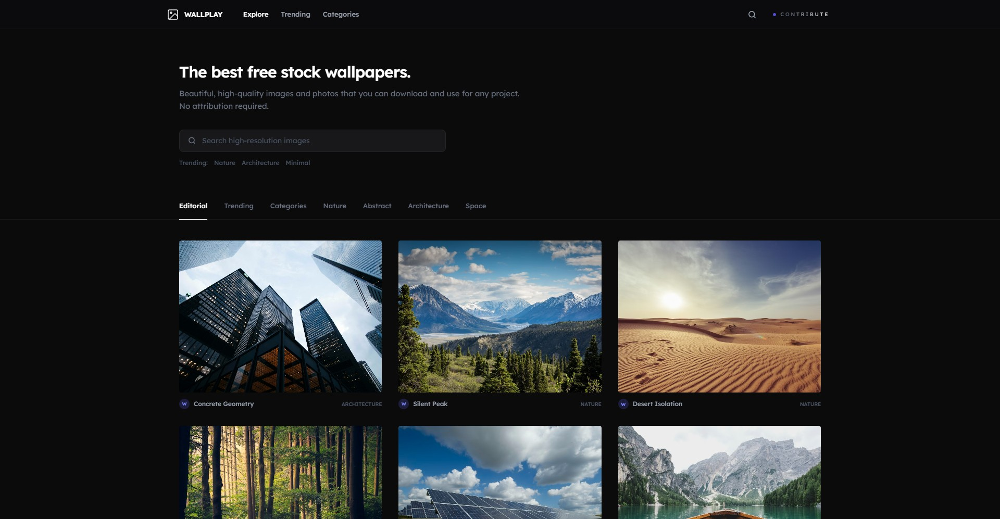

<div align="center">


<br />
<br />


</div>

<br/>

## WallPlay

WallPlay is a high-end, minimalist wallpaper curation platform built with Laravel 11. Designed for visual excellence, it provides a sophisticated interface for discovering, filtering, and contributing high-fidelity digital artworks. It features a professional backend architecture using the Repository and Service patterns to ensure scalability and clean code standards.

## Preview

<p align="center">
  
</p>

## Features

- **Minimalist Editorial Grid:** A clean, distraction-free gallery layout inspired by high-end design monographs.
- **Dynamic Trending Feed:** A curated section highlighting high-demand visuals from the community.
- **Typographic Category Index:** A sophisticated architectural directory for browsing specific visual ecosystems.
- **Global Search Overlay:** A high-fidelity, full-screen search experience powered by Alpine.js for instant discovery.
- **Seamless Contribution:** A refined "Submit Artwork" flow allowing creators to add masterpieces to the archive.
- **Advanced SEO:** Best-practice implementation including dynamic OpenGraph tags and social sharing previews.

## Tech Stack

- **Laravel 11:** The latest PHP framework for robust, modern web application development.
- **Repository & Service Pattern:** Professional architectural decoupling for cleaner code and easier testing.
- **Tailwind CSS v4:** High-fidelity styling using the latest utility-first framework standards.
- **MySQL:** Structured relational database for reliable metadata and collection management.
- **Alpine.js:** Lightweight JavaScript for high-performance micro-interactions and overlays.
- **Lexend Typography:** A modern geometric typeface chosen for its balance and high-end aesthetic.

## Getting Started

To get a local copy of this project up and running, follow these steps.

### Prerequisites

- **PHP 8.2** or higher.
- **Composer** for dependency management.
- **Node.js & NPM** for asset compilation.
- **MySQL Server**.

## Installation

1. **Clone the repository:**

   ```bash
   git clone https://github.com/fahmirizalbudi/wallplay.git
   cd wallplay
   ```

2. **Install dependencies:**

   ```bash
   composer install
   npm install
   ```

3. **Configure Environment:**

   ```bash
   cp .env.example .env
   php artisan key:generate
   ```
   *Note: Update your `.env` with your MySQL credentials.*

4. **Initialize Database:**

   ```bash
   php artisan migrate --seed
   ```

## Usage

### Development

Run the following commands in separate terminals to start the development environment:

- **Laravel Server:** `php artisan serve`
- **Vite (Hot Reloading):** `npm run dev`

Access the application at [http://localhost:8000](http://localhost:8000).

## License

All rights reserved. This project is for educational purposes and portfolio demonstration only.
